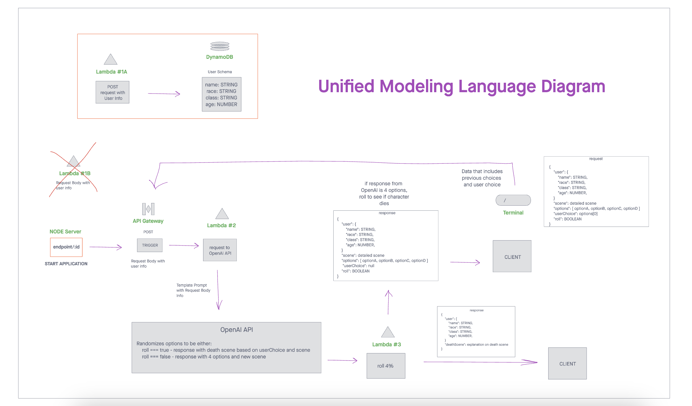

# Quest-forge


## Application Description (About)

* QuestForge is  A text-based, Dungeons and Dragons themed choose your own adventure game. Users will be able to interact with responsive story prompts, and have a host of story options in order to decide their fate! NPC's and story dialogue will be generated via OpenAI integration.

## Authors

* [Chester Lee Coloma] (<https://github.com/cleecoloma>)
* [Joshua Shea] (<https://github.com/jshea44>)
* [Anthony Cunningham] (<https://github.com/Spacecowboi>)

## Features

* Choose your own adventure!
* Interactive story prompts
* AI-Generated Dialogue and walkthrough
* D&D themed storytelling and immersion

## Installation

* Clone down the respective repos located on our organization page (<https://github.com/GUI-Goblins>)
* Create API Gateway on AWS with the following criteria:
> 1. POST to an {endpoint}- to create user with following schema:
> ```javascript
> {
>   "id": NUMBER, // Update id on URL on server.js of simple-backend-api repo
> 	"name": STRING,
>	"race": STRING,
>	"class": STRING,
>	"age": NUMBER,
>}
> ```
> 2. POST to an {endpoint/:id} using the id create with the user. Update endpoint on server.js of simple-backend-api repo with endpoint created above.
* Create 4 separate lambda functions below using repos below:
> 1. Create User (<https://github.com/GUI-Goblins/lambda-create-user>)
> 2. Trigger OpenAI Request (<https://github.com/GUI-Goblins/lambda-openai-request>)
> 3. Send OpenAI Request (<https://github.com/GUI-Goblins/lambda-openai-prompt>)
>
>>   Create env files with following info:
>>       OPEN_AI_URL - {CHAT_COMPLETIONS_OPENAI_URL}
>>       OPENAI_API_KEY - {USE_YOUR_OWN_OPENAI_API_KEY}
> 4. Roll Character End (<https://github.com/GUI-Goblins/lambda-openai-roll>)
* Export the code located in the respective repos above to AWS Lambda using:
> 1. GitHub Actions
> 2. Zip code and upload to AWS
* Create a node server
> Simple Backend Server (<https://github.com/GUI-Goblins/simple-backend-api>)
>
>> Update URL to the POST endpoint created on API Gateway:
>> endpoint/:id
* Create a Vite/React frontend
> Simple Frontend Application (<https://github.com/GUI-Goblins/simple-frontend-app>)
>
>> Create env file below:
>> SERVER_URL - {URL_TO_BACKEND_SERVER}

## Unified Modeling Language (UML) Diagram

> See UML Diagram below to check the overall architecture of this application
[Link to UML](https://projects.invisionapp.com/freehand/document/Og97QVUVy)


## Dependencies 

* aws-sdk
* AWS Access and Secret Keys
* axios
* dot-env
* dynamoose
* dynamoDB
* environment variables
    * Please create an OpenAI account if you do not already have one, and generate a secret key as you will need it in order to access the API!
    * Place the Secret Key into your environment variable as a value with a key of "OPENAI_API_KEY"

## We would like to give thanks to:
* Jacob
* ChatGPT
* Stack Overflow
* Slidesgo